# Привет, я Ivan Kurbakov 👋

  

## Мой технологический стек 💻

<table>
  <tr>
    <td align="center">
      
       HTML
    </td>
    <td align="center">
      
       CSS
    </td>
    <td align="center">
      
       JS/TS
    </td>
    <td align="center">
      
       Next.js/React
    </td>
    <td align="center">
      
       Tailwind
    </td>
    <td align="center">
      
       Node.js/Express
    </td>
  </tr>
</table>

## Интересуюсь 🔍

## Мой аватар 🎮

  

## Not a vibe coder
